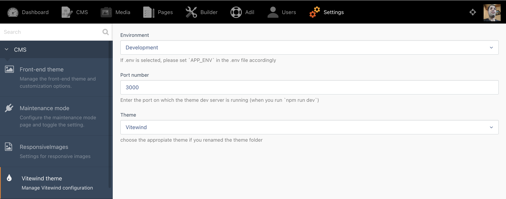
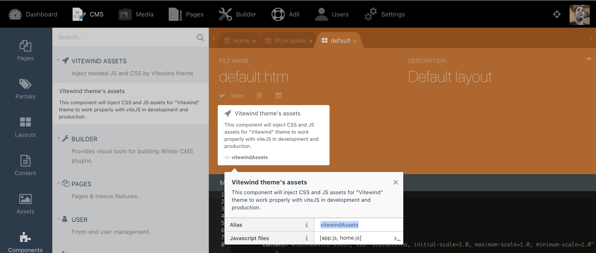
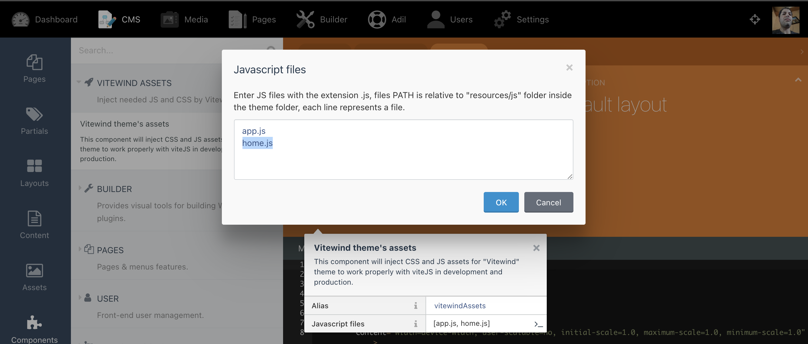

<h1 align='center'>Vitewind theme</h1>

<p align='center'><a href="https://github.com/windicss/windicss">💨Windi CSS</a> and <a href="https://github.com/vitejs/vite"> ⚡️Vite</a>, for <a href="https://octobercms.com"> 🍂OctoberCMS</a>  & <a href="https://wintercms.com/">❄️WinterCMS</a><br>
</p>

<p align='center'>
  
  
</p>


## Features

- ⚡️ **It's FAST** - 20~100x times faster than Tailwind on Vite
- 🧩 On-demand CSS utilities (Fully compatible with Tailwind CSS v2)
- 🍃 Load configurations from `tailwind.config.js`
- 📄 CSS `@apply` / `@screen` directives transforms
- 🎳 Support Variant Groups - e.g. `bg-gray-200 hover:(bg-gray-100 text-red-300)`
- 😎 ["Design in Devtools"](https://windicss.org/integrations/vite.html#design-in-devtools) - if you work this way in the traditional Tailwind.
- 😎 ["Attributify mode"](https://windicss.org/posts/v30.html#attributify-mode), code like this
  ```html
  <button class="bg-blue-400 hover:bg-blue-500 text-sm text-white font-mono font-light py-2 px-4 rounded border-2 border-blue-200 dark:bg-blue-500 dark:hover:bg-blue-600">
    Button
  </button>
    ```
  can be written like:

  ```html
  <button
    bg="blue-400 hover:blue-500 dark:blue-500 dark:hover:blue-600"
    text="sm white"
    font="mono light"
    p="y-2 x-4"
    border="2 rounded blue-200">
    Button
  </button>
  ```
   just enabled it by
  ```javascript
  // windi.config.js
  export default {
  attributify: true
  }
  ```

## Installation

Go to your backend to **Settings > System > Updates & Plugins** and install the theme `Chkilel.Vitewind`, then install the following Plugin. (just copy & paste the PluginID below and put it in the search box.)
```
    - Chkilel.VitewindManager
```
> Cannot work without Vitewind Manager plugin, please install before to use the theme.

## Theme Setup

You must first install the theme dependencies. **In the theme folder**, execute:

```
npm install
```

## Theme settings
Go to your backend to **Settings > Vitewind theme**, and configure the following settings:



        Environment:
            - Use `.env` configuration  : will use the `APP_ENV` value in the .env file
            - Development               : if you are working on the theme development (npm run dev)
            - Production                : if you are in production, the theme must be built before (npm run build)

        Port number : Enter the port on which the theme dev server is running (when you run `npm run dev`), default to 3000.

        Theme: select the appropiate theme, if you modified the theme name in the `theme.yaml` file.


## Vite config file

> - If you rename the theme folder, please adjust the name [VITE_WIND_RENAMED] in `vite.config.js` accordingly.
> - If you need many JS files for your layouts, add them all to the `build.rollupOptions.input` config array to be compiled.

```javascript
import WindiCSS from 'vite-plugin-windicss'
export default ({command}) => ({
    base: command === 'serve' ? '' : '/themes/[VITE_WIND_RENAMED]/public/build/', // Addjust the name of the theme
    publicDir: 'fake_dir_so_nothing_gets_copied',
    processCssUrls: true,
    build: {
        manifest: true,
        outDir: 'public/build',
        rollupOptions: {
            input: [
                'resources/js/app.js',
                'resources/js/home.js',
                // Add here all the files you need if you load different javascript code in each layout
                'ressource/js/myFirstAddedFile.js',
                'ressource/js/mySecondAddedFile.js',
                ...
            ],
        },
    },
    plugins: [...],
});
```

## Layout component

The **Vitewind plugin** register a layout component to inject JS and CSS assets,manage **hot reload** in Development and inject **build assets** in production.



Put the component in every layout and set the JS files you need to load for that layout.




## Development
Run the command below in your theme folder:

```
npm run dev
```
The theme DEV server will start on `http://localhost:3000/` and listen to any modification in your `.htm` files ( layouts, pages, partials,...).
then, you can visite your site on its usual URL and start development.

> Note the **port of the dev server**, if different from 3000 you need to adjust it in the backend settings.

## Production build

Use `npm run build` to compile your assets.

```
npm run build
```
> Don't forget to adjust the `Enviroment` to **production** in the backend settings.

## Theme License

MIT License - check out [LICENSE](LICENSE) file for MIT license details.

## Changelog

#### 1.0.0 : initial release
- Vitewind: the magic of Windi CSS and the speed of Vite JS
#### 1.0.1 : Update theme dependency
- Update theme dependencies
#### 1.1.0 : Update dependencies and fix minor bugs
- Fix theme directory path in `vite.config.js`
